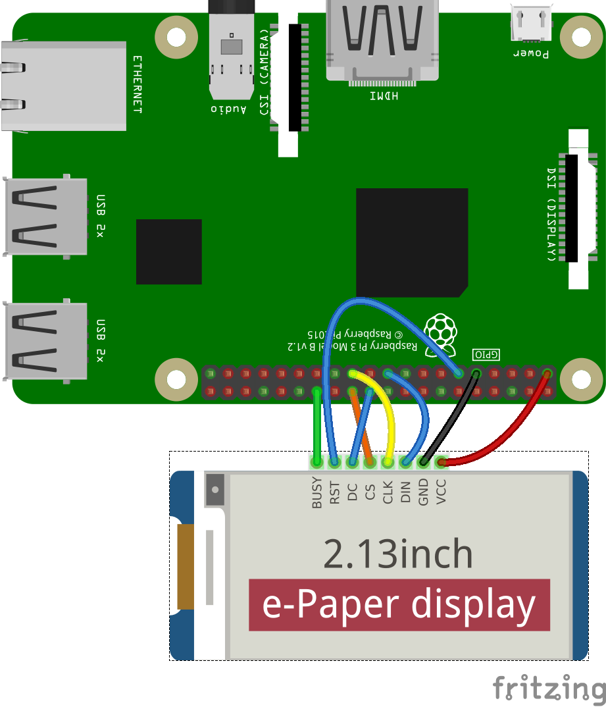

# EPD 2.13inch e-paper (B) by SPI sample



[Script is here.](./epd2in13b.rb)

E-paper displays the [Lorem ipsum](https://www.lipsum.com/) in red and black letters.

```sh
$ sudo apt-get -f install imagemagick libmagickcore-dev libmagickwand-dev
$ sudo gem i rmagick
$ sudo pigpiod
$ ruby epd2in13b.rb
```
