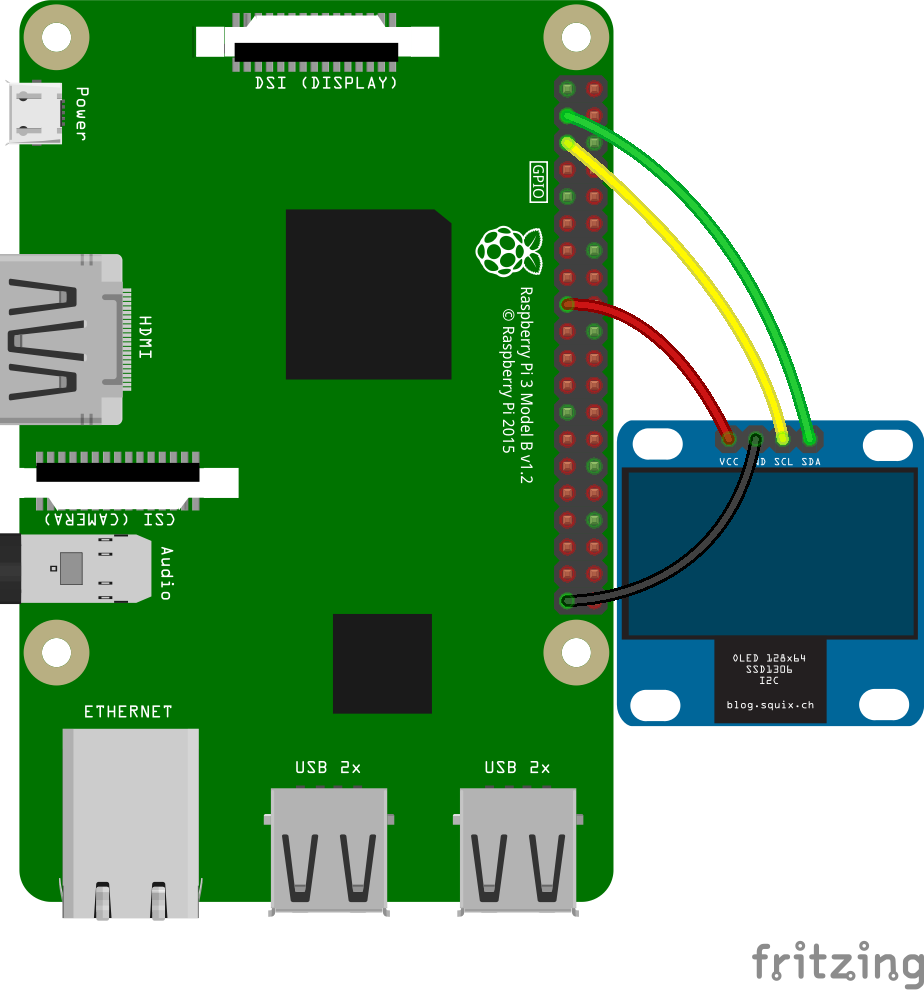

# SSD1306 by I2C sample



[Script is here.](./ssd1306.rb)

SSD1306 displays the [Lorem ipsum](https://www.lipsum.com/).

```sh
$ sudo apt-get -f install imagemagick libmagickcore-dev libmagickwand-dev
$ sudo gem i rmagick
$ sudo pigpiod
$ ruby ssd1306.rb
```
